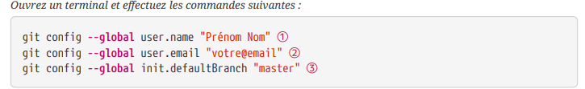
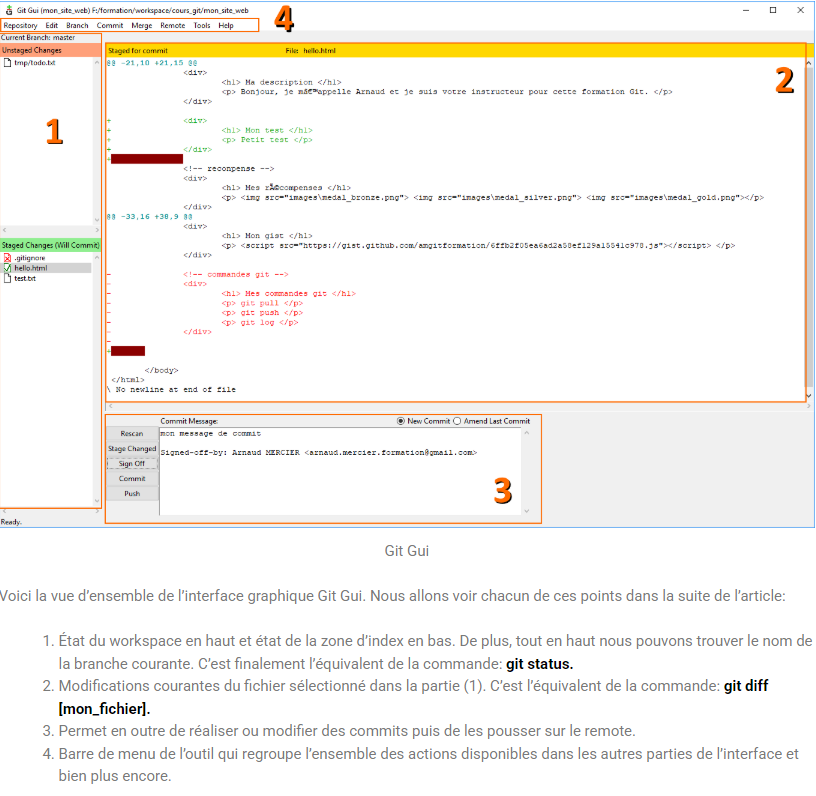
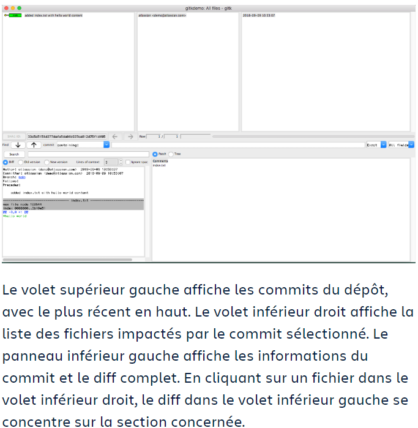
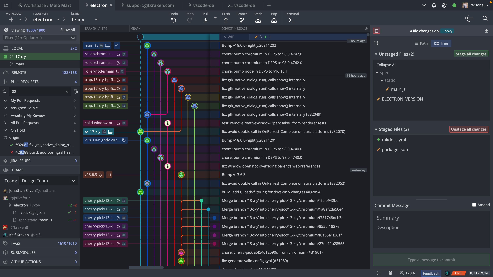

:icons: font
:author: Florian GAVOILLE, Sebastian NOVAK et Sulivan CERDAN
:email: florian.gavoille.etu@univ-lille.fr - sebastian.novak.etu@univ-lille.fr - sulivan.cerdan.etu@univ-lille.fr

== Rapport SAE 2.03 - Semaine 3 

=== [red]#1.Configuration de Git# 



*Les deux premières commandes permettent de s'identifier à notre compte git. Le paramètre --global permet de sauvegarder cette configuration sans devoir la remettre à chaque connexion.*

*La troisième commande permet de créer automatiquement une branche master lors de l'execution de la commande git init (donc à la création d'un dépôt).*

=== [red]#2.Interfaces graphiques# 
- Qu’est-ce que le logiciel gitk ? Comment se lance-t-il ?

- Qu’est-ce que le logiciel git-gui ? Comment se lance-t-il ?

Les deux logiciels sont des interfaces graphiques pour la commande git. Gtik permet de voir l'historique des depots graphiquement, tandis que git-gui est une interface graphique complete, permettant la gestion des commits.

On les lance avec :

``` 
gitk

git gui
```
Voici l'interface de git-gui avec une explication brève de l'interface :



De même pour l'interface de gitk :

 

=== [red]#3.Autres interfaces#

Git dispose d'un *grand* nombre d'interfaces graphiques utiles, l'un d'entre eux etant https://www.gitkraken.com/git-client[GitKraken], une interface graphique tres populaire. Sa popularite est une des raisons pour laquelle on l'a choisi mais aussi pour son design ressemblant a Visual Studio Code qui nous a beaucoup plu.

Pour l'installer on a eu besoin de deux commandes :

```
wget https://release.gitkraken.com/linux/gitkraken-amd64.deb

sudo apt install ./gitkraken-amd64.deb
```

Voici une image de l'interface de gitkraken : 




=== Comparaison a gitk et git-gui :

[%header, cols=2*]
|===
|[green]#Avantages# |[red]#Desavantages#

|Une interface facile a comprendre et plus riche comparee a gitk et git-gui
|Peut etre complique a prendre en main pour les debutants

|Les fonctionnalites de gitk et git-gui sont presentes dans gitkraken et on retrouve encore plus de fonctionnalites utiles telles que le Workspace Management qui permet d'organiser son espace de travail de maniere efficace
|C'est une interface graphique connue pour etre assez lente

|Une appli facilement personalisable pour l'ajuster a ses preferences
|Existence d'un centre d'aide avec des problemes frequemment rencontres mais aucun forum officel permettant aux utilisateurs de faire part de problemes plus particuliers

|===

