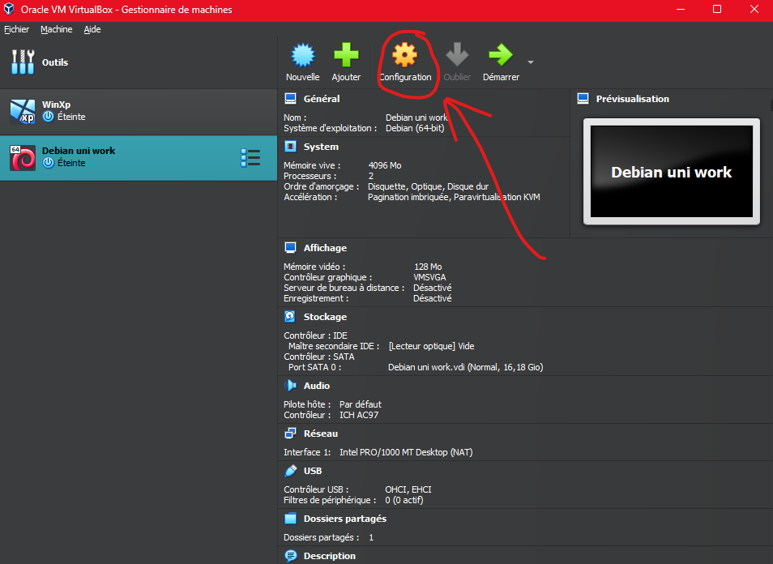
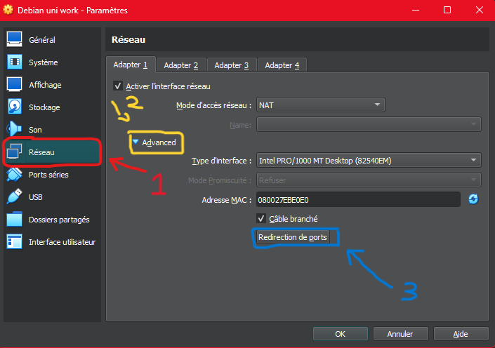
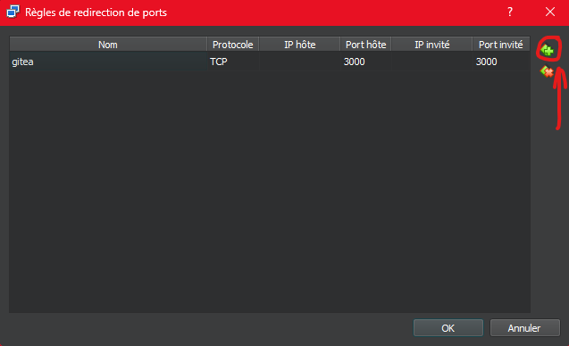
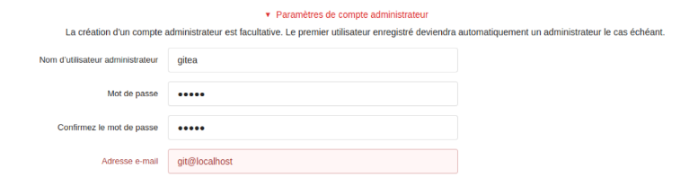

== Rapport SAE 2.03 - Semaine 4
:icons: font
:author: Florian GAVOILLE, Sebastian NOVAK et Sulivan CERDAN
:email: florian.gavoille.etu@univ-lille.fr - sebastian.novak.etu@univ-lille.fr - sulivan.cerdan.etu@univ-lille.fr

=== Redirection de port

Pour redirectionner les ports sur Virtual Box la demarche est relativement simple : 

*[underline]#Etape 1 : Allez sur le menu de virtual box et appuyez sur le bouton "Configuration" :#*

*Fig 1 : Acceder a la configuration de la machine*

Etape 2 : Dans le menu de configuration, allez dans la categorie [red]#Reseau# et appuyez sur le bouton [red]#Avance# pour ensuite appuyer sur le bouton [red]#Redirection de ports# :

*Fig 2 : Acceder a la rubrique reseau*

Etape 3 : Dans le menu de redirection des ports, appuyez sur le bouton d'ajout (entoure en [red]#rouge#) et rentrer les memes elements que dans la *Fig 3* :

*Fig 3 : Menu de redirection des ports*

=== Reponses aux questions :

• Qu’est-ce que Gitea ?
• À quels logiciels bien connus dans ce domaine peut-on le comparer ?
• Qu’est-ce qu’un fork (dans le domaine du développement logiciel bien entendu) ?
• De quel logiciel Gitea est-il le fork ? Ce logiciel existe-t-il encore ?

[red]#Gitea# est un logiciel "All-in-one" d'hebergement de developpement sous licence MIT. Similaire a [red]#Github# et [red]#Gitlab#, il permet d'heberger du code, de gestioner ses projets informatiques, ainsi que leur code. Le deploiement et la maintenance du code est aussi facile a effectuer ce qui fait de Gitea un bon outil pour les petites equipes ou developpeurs individuels.

Un [blue]#fork# est un nouveau logiciel cree a partir du code source d'un logiciel existant. C'est comme creer une nouvelle maison a partir d'un modele existant. Dans le cas de Gitea, il a ete fork a partir du logiciel [blue]#Gogs# et selon les developpeurs presque tout le code a ete change. Le logiciel Gogs existe encore.
[TIP]
[gray]#Sources# :
  https://docs.gitea.com[Documentation de Gitea] et https://fr.wikipedia.org/wiki/Fork_(développement_logiciel)[Wikipedia : Fork]

== Installation de Gitea

Cette partie a été rédigée à l'aide de la documentation officielle de Gitea, disponible via https://docs.gitea.io/en-us/install-from-binary/[ce lien].

=== Télécharger le fichier

La première étape est de télécharger la version de Gitea que vous souhaitez sur https://dl.gitea.com/gitea/[ce site]. Il est recommandé pour Linux de choisir la version `linux amd64` (nous avons procédé ainsi).
Il est également possible de passer par wget :

----
wget -O gitea https://dl.gitea.com/gitea/main-nightly/gitea-main-nightly-linux-amd64
chmod +x gitea
----

=== Vérifier les signatures GPG
Gitea est sécurisé par des https://keys.openpgp.org/search?q=teabot%40gitea.io[clés GPG] afin d'éviter les modifications involontaires ou fatales du fichier binaire.
Pour décrypter le fichier, voici les commandes à effectuer :

----
gpg --keyserver keys.openpgp.org --recv 7C9E68152594688862D62AF62D9AE806EC1592E2
gpg --verify gitea-main-nightly-linux-amd64.asc gitea-main-nightly-linux-amd64
----

=== Configurer un utilisateur gestionnaire
Pour faciliter la gestion, nous allons créer un utilisateur `git` qui aura toutes les permissions (et qui sera le propriétaire) des fichiers gitea que l'on configurera.

La commande suivante permet de créer cet utilisateur :

----
adduser \
   --system \
   --shell /bin/bash \
   --gecos 'Git Version Control' \
   --group \
   --disabled-password \
   --home /home/git \
   git
----

=== Préparation de l'environnement
Certains dossiers, qui nous seront utiles plus tard, sont à créer et configurer.

Ces commandes permettent de créer les dossiers obligatoires au bon fonctionnement de Gitea et à configurer les permissions pour l'utilisateur Git :

----
mkdir -p /var/lib/gitea/{custom,data,log}
chown -R git:git /var/lib/gitea/
chmod -R 750 /var/lib/gitea/
mkdir /etc/gitea
chown root:git /etc/gitea
chmod 770 /etc/gitea
----

=== Finalisation
Ces commandes permettent de finaliser la configuration de Gitea :

----
export GITEA_WORK_DIR=/var/lib/gitea/
cp gitea /usr/local/bin/gitea
----

=== Premier lancement
Pour lancer Gitea, exécutez la commande :

----
GITEA_WORK_DIR=/var/lib/gitea/ /usr/local/bin/gitea web -c /etc/gitea/app.ini
----

Cette commande lancera le serveur Gitea.

=== Paramètrage au premier lancement
Après avoir lancé votre serveur, rendez-vous dans votre navigateur et allez sur l'adresse `localhost`

Nous configurerons le type de Base de données sur "sqlite3", puis créerons le compte admin de nom "gitea", de mot de passe "gitea" et d'adresse gitea@localhost

[NOTE]
Votre Gitea est désormais installé et configuré ! Vous pouvez l'utiliser dès à présent !

*[underline]#Question : Comment voir la version actuelle de Gitea ?#* +
Exécutez la commande `gitea --version` dans un terminal et la version s'affichera.

*[underline]#Question : Comment mettre à jour Gitea sans tout reconfigurer ?#* +
Tout d'abord, il est recommandé de faire une backup de la version acutelle pour éviter toute perte de donnée.

Les commandes suivantes sont les commandes recommandées par la documentation.

Avec l'utilisateur git créé précédemment, rendez-vous dans le dossier contenant le fichier gitea et executez :
----
./gitea dump -c /path/to/app.ini
----

Des sorties similaires devraient apparaître
----
2016/12/27 22:32:09 Creating tmp work dir: /tmp/gitea-dump-417443001
2016/12/27 22:32:09 Dumping local repositories.../home/git/gitea-repositories
2016/12/27 22:32:22 Dumping database...
2016/12/27 22:32:22 Packing dump files...
2016/12/27 22:32:34 Removing tmp work dir: /tmp/gitea-dump-417443001
2016/12/27 22:32:34 Finish dumping in file gitea-dump-1482906742.zip
----

La configuration étant désormais sécurisée, nous pouvons continuer pour la mise à jour.
Il est très simple de mettre à jour :

* Téléchargez la nouvelle version sur https://dl.gitea.com/gitea/
* Modifiez le fichier `/usr/local/bin/gitea` par le fichier que vous venez de télécharger
* Relancez Gitea

*Gitea est désormais à jour.*

En cas de problème, vous pouvez revenir sur la backup avec les commandes suivantes :
----
unzip gitea-dump-1610949662.zip
cd gitea-dump-1610949662
mv app.ini /etc/gitea/conf/app.ini
mv data/* /var/lib/gitea/data/
mv log/* /var/lib/gitea/log/
mv repos/* /var/lib/gitea/data/gitea-repositories/
chown -R gitea:gitea /etc/gitea/conf/app.ini /var/lib/gitea
----

