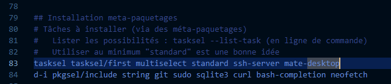
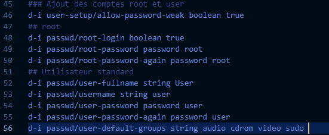

== Rapport SAE 2.03 - Semaine 1
:icons: font
:author: Florian GAVOILLE, Sebastian NOVAK et Sulivan CERDAN
:email: florian.gavoille.etu@univ-lille.fr - sebastian.novak.etu@univ-lille.fr - sulivan.cerdan.etu@univ-lille.fr

Réponses aux questions et commandes effectuées

=== Configuration matérielle dans VirtualBox
*[underline]#Question 1 :#* +
Le `64 bit` dans `Debian 64 bit` indique que cette version de l'OS peut accéder à un total de *2^64* adresses mémoires, soit *16 milliards de gigaoctets* de mémoire. D'un point de vue matériel, les systèmes _32 bit_ peuvent avoir un maximum de 4 Go de RAM, alors que les systèmes _64 bit_ n'ont pas réellement de limitefootnote:[Il est impossible d'avoir 16 milliards de giga octet de RAM à l'heure actuelle] +
https://learn.microsoft.com/en-us/answers/questions/1610861/whats-the-difference-between-32-bit-and-64-bit[Source]

[NOTE]
Les ordinateurs et OS récents fonctionnent sur une architecture *64 bits*

*[underline]#Question 2 :#* +
Le mode de connexion utilisé par défaut par _Virtualbox_ est le *NAT*. Cette méthode permet de créer un réseau local virtuel propre à la VM et dont Virtualbox est le routeur. Autrement dit, sur le réseau local de la machine physique, la VM n'aura pas d'adresse IP attribuée, la seule adresse qui lui sera attribuée sera au sein du réseau virtuel créé.footnote:[Cette méthode peut être contournée en ajoutant une règle de redirection de port dans la configuration de la machine virtuelle] +
https://www.it-connect.fr/comprendre-les-differents-types-de-reseaux-virtualbox/[Source]

[NOTE]
Il existe d'autres manières de configuration réseau, pas par défaut et *plus complexes*, plus optimisées que le *NAT*

*[underline]#Question 3 :#* +
Le fichier de configuration s'appelle `sae203.vbox` et se trouve dans le dossier `/usr/local/virtual_machine/infoetu/login/vbox_vms/sae203`. Il est écrasé à chaque sauvegarde de la machine. +
https://docs.oracle.com/en/virtualization/virtualbox/6.0/admin/vboxconfigdata.html[Source]

*[underline]#Question 4 :#* +
Il *n'est pas recommandé* de modifier la configuration de la VM depuis le fichier *XML*. La documentation officielle préconise de modifier via l'interface graphique ou le terminal. +
https://docs.oracle.com/en/virtualization/virtualbox/7.0/user/vboxmanage.html[Source]

== Installation OS de base

*[underline]#Question 1 :#* +
Un fichier `ISO`, du format ISO 9660 ou 13346, contient *toutes les données que l'on souhaite transférer sans les compresser* (contrairement à un fichier d'archive). Il contient fréquemment *toutes les données* et la *structure* nécessaires pour lancer un système d'exploitation ou un programme depuis un support externe (CD, DVD, Clé USB). +
https://www.ionos.fr/digitalguide/serveur/know-how/quest-ce-quun-fichier-iso[Source]

*[underline]#Question 2 :#* +
*MATE* et *GNOME* sont des *environnements graphiques* utilisés principalement sur *[red]#Debian#*. Ils définissent comment les informations seront *affichés* à l'écran et le *style* de ces derniers. Autrement dit, l'environnement graphique définit le comportement de *l'interface graphique*.
https://fr.wikipedia.org/wiki/GNOME[Source]

*[underline]#Question 3 :#* +
Un serveur Web a différentes définitions, l'une d'un point de vue *logiciel*, l'autre *matériel*. +

Software (logiciel):: Un serveur Web d'un point de vue _logiciel_ contient différents *fragments* qui contrôlent la façon dont l'utilisateur peut accéder aux fichiers hébergés. Il comprend au minimum un *serveur HTTP* qui contient les url et le protocole HTTP. +
Hardware (matériel):: Un serveur Web d'un point de vue _matériel_ est un ordinateur qui stocke *tous les fichiers d'un site web* et qui les *envoie* aux appareils qui se rendent sur le site. +

Il y a deux types de serveurs web :
[horizontal]
Statique:: Composé d'un *ordinateur* et d'un *serveur HTTP*, il envoie les fichiers hébergés *tels quels* au navigateur.
Dynamique:: Il contient, en plus du serveur statique, des *composants logiciels*, comme des _serveurs d'applications_ ou des _bases de données_. Il *met à jour les données* avant de les envoyer au serveur via HTTP.
https://developer.mozilla.org/fr/docs/Learn_web_development/Howto/Web_mechanics/What_is_a_web_server[Source]

*[underline]#Question 4 :#* +
Un serveur SSH établit un lien *sécurisé* entre un utilisateur et un serveur. Il permet *d'accéder* à des fichiers sur un serveur, qui seront *chiffrés* durant le transfert, et *d'effectuer des commandes* à distance. +
https://www.hostinger.fr/tutoriels/ssh-linux[Source]

*[underline]#Question 5 :#* +
Un _serveur mandataire_ (ou _proxy_) est un programme *intermédiaire* utilisé lors de la navigation sur internet. En plus de *faciliter* l'accès au *web*, il peut *recevoir* les demandes du client et *retourner* les réponses. Dans certains cas, il peut aussi *transmettre* des requêtes. Il existe deux types de proxy : +
[horizontal]
Proxy direct:: Il gère les demandes *depuis et vers n'importe où sur internet.* +
Proxy inverse:: Il prend des *requêtes* d'internet pour les *envoyer* vers un serveur d'un _réseau interne._ +

https://developer.mozilla.org/fr/docs/Glossary/Proxy_server[Source]

=== Sudo

Commandes utilisées :

=> Ajouter l'utilisateur `user` au groupe des sudoers
[source:bash]
----
sudo usermod -aG sudo user
----

=> Afficher les groups du `user`
[source:bash]
----
groups user
----

== Suppléments invité

*[underline]#Question 1 :#* +
Pour récupérer la version de notre noyau, nous pouvons effectuer la commande suivante dans un terminal :
[source:bash]
----
uname -r
----
On remarque que notre noyau est sur la version 6.1.0-30-amd64.

*[underline]#Question 2 :#* +
Les compléments invités permettent d'améliorer l'utilisation de virtualbox avec :
[%header, cols=2*]
|===
|Ajout |Description

|Meilleure intégration de la souris
|Le pointeur peut passer plus facilement et fluidement de l'ordinateur à la VM

|Presse-papier partagé
|Tout ce que l'on copie de l'ordinateur sera aussi dans le presse-papier de la VM et inversement

|Dossiers partagés
|Accès plus facile aux dossiers de l'ordinateur depuis la VM

|Meilleur support graphique
|C'est grâce à cette fonctionnalité que l'on peut modifier la taille de la fenêtre de notre VM et que cette dernière s'adapte totalement
|===

Cette liste est non exhaustive mais constitue les principaux changements. +
https://www.virtualbox.org/export/43085/vbox/trunk/doc/manual/fr_FR/user_GuestAdditions.xml[Source]

*[underline]#Question 3 :#* +
La commande `mount` permet d'**attacher** une partition *externe* au système (pouvant être un disque externe comme une autre partition du disque principal) au *système de fichier* `/`. +
Un *exemple* simple est lorsque l'on sépare le `/home` de la partition `/`, on crée une partition externe qui sera *montée* à chaque lancement et rattachée au fichier `/home`. +
Dans notre cas, on souhaite accéder aux fichiers contenus dans le CD-ROM. Pour cela, on va définir le dossier `/mnt` comme point de montage, nous permettant d'accéder aux fichiers du CD-ROM par `/mnt`. +
Source : `man mount`

== Quelques questions sur la documentation [red]#Debian#
*[underline]#Question 1 :#* +
[red]#Debian# est une distribution *GNU Linux* qui se veut _libre_ et de _qualité supérieure_. Développé entièrement *bénévolement*, la distribution [red]#Debian# est *stable*, *complète* footnote:[La documentation parle de presque 65 000 paquets de logiciels disponibles à l'installation], *gratuite* tant à l'utilisation qu'à l'amélioration et la redistribution et *active* grâce au travail régulier de plus de *1600 bénévoles*. +
Le nom [red]#Debian# vient de la contraction de **Deb**ra et *Ian* Murdock, les deux créateurs originels du projet. 

https://www.debian.org/doc/manuals/debian-faq/basic-defs.en.html[Source]

*[underline]#Question 2 :#* +
Il y a *3 équipes* support différentes pour les différentes durées de prise en charge :

[red]#Debian# stable support:: L'équipe chargée du *support* des *dernières version stables* de [red]#Debian#. Cette équipe est composée des *équipes de sécurité et de Release de [red]#Debian#* et s'occupent de mettre à jour la dernière version pour la *maintenir stable*. Durée : _environ 3 ans_
LTS / [red]#Debian# oldstable support:: Cette équipe est chargée de *prolonger* le support des *anciennes versions* pour que ces dernières soient stables pendant 5 ans. L'équipe travaille sur les versions qui *ne sont plus assurées* par le *[red]#Debian# stable support* et est composée de *bénévoles indépendants* des équipes release et sécurité de [red]#Debian#. Durée : _environ 2 ans_
ELTS support:: La *dernière étape* avant qu'une version *ne recoive plus d'aide support*. Cette équipe, agissant *après* le *LTS* support, reste tout autant *bénévole et indépendante* des équipes release et sécurité [red]#Debian#. Elle agit pendant **5 ans**footnote:[Sauf la version [red]#Debian# 7 "Wheezy" qui elle n'a reçu que 2 ans de support ETLS, et les versions antérieures n'ayant pas reçu de support ELTS] pour qu'une version puisse atteindre les *10 ans de vie*. 

https://wiki.debian.org/LTS[Source LTS et Debian Stable] +
https://wiki.debian.org/LTS/Extended[Source ELTS] +
https://wiki.debian.org/DebianReleases[Source Releases]

*[underline]#Question 3 :#* +
La durée de vie d'une version dépend de l'arrivée des *équipes support, LTS et ELTS*. En effet, les versions *avant la 2.0* n'ont pas reçu de support. *Les versions avant [red]#Debian# 6* n'ont reçu que du support pendant *3 ans ou moins*, assuré par les *équipes release et sécurité* [red]#Debian#. La *version 2.1* est une excpetion car elle a reçu du support LTS pendant... _1 mois seulement_. L'équipe *LTS* n'a ensuite plus été sollicité jusqu'à la version *[red]#Debian# 6*, qui a été *la première* à recevoir *2 ans de support LTS*, amenant sa durée de vie à *5 ans*. *[red]#Debian# 7* a ensuite inauguré *l'ELTS* avec *2 ans de support supplémentaires*, amenant sa durée de vie à *7 ans*. Les *version ultérieures* ont reçu et recevront les durées de support citées précédemment pour atteindre *10 ans* de durée de vie.

_Les sources sont les mêmes que pour la question 2_

*[underline]#Question 4 :#* +
Il y a au minimum *1 version* activement maintenue par [red]#Debian#.
https://wiki.debian.org/DebianReleases[Source]

*[underline]#Question 5 :#* +
Les noms de code sont basés sur les *noms des personnages* de *Toy Story*. En effet, la personne ayant repris le lead du projet [red]#Debian# après Ian Murdock, *Bruce Perens*, travaillait à *Pixar*, le studio à l'origine de la saga Toy Story. C'est ainsi qu'on retrouve tous les personnages de la série dans les noms de version [red]#Debian#.

https://wiki.debian.org/DebianBuzz[Source]

*[underline]#Question 6 :#* +
Il y a *9 architectures* prises en compte :

* amd64
* i386
* ppc64el
* s390x
* armel
* armhf
* arm64
* mipsel
* mips64el

https://wiki.debian.org/DebianBullseye[Source]

*[underline]#Question 7 :#* +
La première version avec un nom de code était *[red]#Debian# 1.1*, sous le nom de *Buzz* pour Buzz l'éclair, a été annoncée le *17 juin 1996*. Elle n'aura duré que quelques mois puisque la version Rex la remplacera en décembre de la même année.

https://wiki.debian.org/DebianBuzz[Source]

*[underline]#Question 8 :#* +
La dernière version annoncée à ce jour est *[red]#Debian# 15* sous le nom de *Duke*, qui a été annoncée le *22 janvier 2025*.

https://wiki.debian.org/DebianDuke[Source]

== _2. Tutoriel pour l'installation d'une VM automatisée :_

[.text-center] 
 Afin de mener a bout ce processus vous aurez besoin de :
 L'application Oracle Virtual Box
 Les fichiers de configuration et VISO de Moodle mentionnees sur le PDF de la SAE.

L'installation va s'effectuer en 7-8 etapes :

* [ ] A l'aide de Virtual Box, creer une VM avec ces specifications :
 - Type : Linux
 - Version : Debian 64-bit
 - Mémoire vive (RAM) : 2048 Mo pour être à l’aise à l’usage.
 - Disque dur : 20 Go, ne pas cocher la case "Pre-allocate Full Size"
 - Cocher la case "Skip Unattended Installation" pour éviter que Virtualbox réalise des actions non souhaités.

* [ ] Extraire depuis Moodle le fichier zip avec le Viso et les fichiers de configuration pour l'installation et placer les contenus dans le dossier ou vous avez fait la VM

* [ ] Remplacer la chaîne @@UUID@@ du fichier S203-Debian12.viso par un identifiant unique universel. Le plus simple est d’exécuter la commande ci-dessous en étant placé dans le même répertoire que votre fichier :
   ``
    sed -i -E "s/(--iprt-iso-maker-file-marker-bourne-sh).*$/\1=$(cat /proc/sys/kernel/random/uuid)/" S203-Debian12.viso
   ``

* [ ] Dans le fichier *preseed.cfg* qui se trouve au meme endroit que le *viso* on doit ajouter quelques commandes pour automatiser totalement l'installation. Ces commandes vont installer quelques applications dont nous avons besoin comme *git* ou *bash-completion* et ajouter l'utilisateur normal au groupe *sudo*.
  - A la ligne 83 : ``tasksel tasksel/first multiselect standard ssh-server mate-desktop``
  - A la ligne 84 : ``d-i pkgsel/include string git sudo sqlite3 curl bash-completion neofetch``
  - A la ligne 56 : ``d-i passwd/user-default-groups string audio cdrom video sudo``

[NOTE]
Fun Fact : La recherche de ces commandes nous a mene sur un forum Google 

Le fichier ressemblera a ceci : 

*Fig1 : Ajout des applis.*

*Fig2 : Ajout de l'user au groupe audio, cdrom, video et sudo.*

* [ ] Aller dans la configuration de la VM et mettre comme *ISO* d'installation le fichier *viso* auquel on a applique la commande *sed* precedemment.

* [ ] Demarrer la VM et attendre que l'installation se complete

* [*] Et voila ! Vous avez une VM installee automatiquement